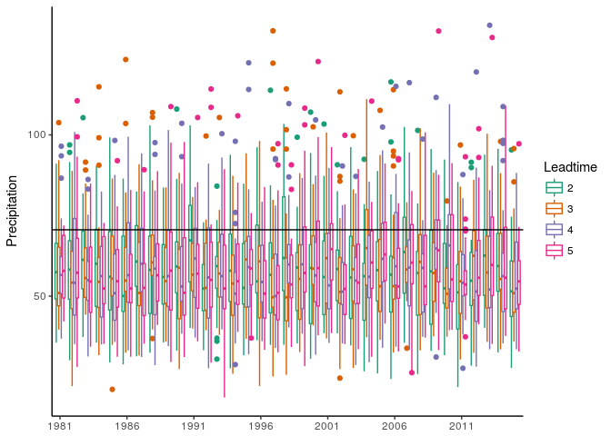
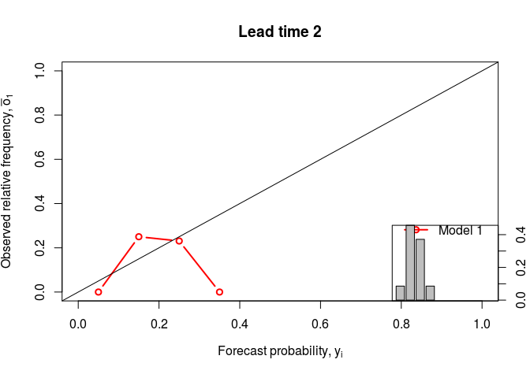
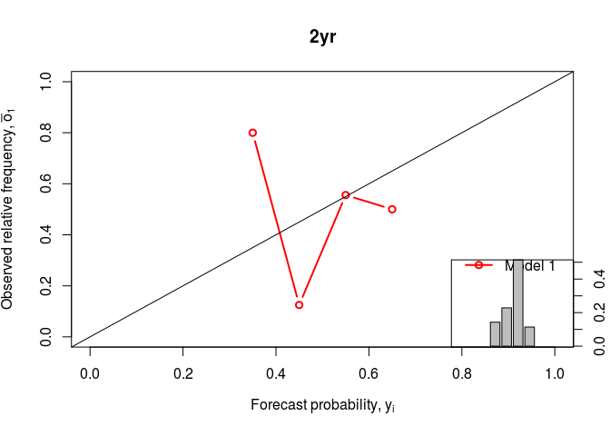

SEAS5 reliability of Scandinavian extreme precipitation trends
================
Timo Kelder
October 19, 2019

Short intro
-----------

In this study, we use Norway and Svalbard as a case study to explore the validity of using SEAS5 to analyze trends in extreme precipitation ('UNSEEN' trends). These regions have recently faced severe events, raising the question whether these kind of events have occurred by chance or a the new norm. From observations, it is impossible to analyze the changes in these severe events: How have the 100-year precipitation events changed over last 35 years? With the SEAS5 large ensemble we can try to answer this question. But how realistic are the SEAS5 trends?

We create a large ensemble of extreme precipitation from the ECMWF SEAS5 system [Johnson et al., 2019](https://www.geosci-model-dev.net/12/1087/2019/gmd-12-1087-2019.pdf). From the SEAS5 hindcasts, we extract 3-day seasonal maximum precipitation for each ensemble and each lead time for each year (4 lead times, 25 ensembles and 35 years: 1981-2016). The idea is that precipitation forecasts are not predictable after two weeks, and therefore the forecasts from different ensemble members and lead times can be seen as plausible realizations of the past. The aim of this large ensemble is to be able to detect and attribute changes in extreme events over the last 35 years. To justify the pooling of ensemble members and lead times, we have assessed the ensemble member independence and the model stability. In this notebook, I would like to further discuss the reliability of extremes in the large ensemble and it's trend over last 35 years.

Reliability
-----------

How can we trust the reliability of large ensembles? The idea of the large ensemble is that we can see 'unseen' extreme events, how can we validate extremes that have not been observed?
In event attribution, the validity of simulated extremes in large ensembles is typically based on the mean state and the ability to simulate the relevant physical processes ( [Angelil et al., 2016;](https://www.sciencedirect.com/science/article/pii/S2212094716300202#s0040) [Vautard et al., 2019](https://link.springer.com/article/10.1007%2Fs00382-018-4183-6)). [Johnson et al., 2019](https://www.geosci-model-dev.net/12/1087/2019/gmd-12-1087-2019.pdf) provide a thorough evaluation of the ECMWF SEAS5 system. Overall, the mean state of SEAS5 reproduces the ERA-Interim reanalysis well. SEAS5 greenhouse gas radiative forcing is the same as in ERA5, and captures long-term trends in emissions. We compare the regional temperature variability of SEAS5 to ERA-Interim for the two study domains. We show that the model follows the observed temperature trend over Svalbard. Over Norway, there seems to be no trend in both the model and the observations. The simulated temperatures over Norway are lower than the observations (ECMWF plots from Laura). Further biases that may be relevant to Autumn extreme precipitation over Norway and Svalbard through teleconnections, are a low bias in Autumn Arctic sea-ice extent and a warm bias in the North Atlantic sea-surface temperature (Johnson et al. 2019). In SEAS5, for the first time an interactive sea-ice module was introduced that enables forecasts of inter-annual variability in sea-ice concentration. Overall, this upgrade has a positive effect on the simulated sea-ice extent, but in Autumn the sea-ice re-freezes too slowly. The bias of the Gulf Stream sea-surface temperatures is a common issues of low-resolution ocean models, which has improved in SEAS5 [Chassignet, 2008](https://agupubs.onlinelibrary.wiley.com/doi/abs/10.1029/177GM05). However, a bias appeared in SEAS5 for the region where the Gulf Stream splits into the North Atlantic subtropical gyre. Furthermore, inhomogeneities in SEAS5 might be introduced because of the increasing amount of assimilated data over time in the ocean and atmosphere reanalysis from which SEAS5 is initialized. <span style="color:red"> Is this paragraph correct and complete? (question mostly directed at ECMWF)</span> ).

The physical drivers of autumn extreme precipitation events over the study domain are predominantly atmospheric rivers (Azad,2017). Previous studies have demonstrated the capability of the ECMWF atmospheric model to simulate atmospheric rivers for Northern Europe (Lavers). This gives confidence in the SEAS5 system to be able to simulate the right physical processes of the large-scale build-up of extreme precipitation over Norway and Svalbard. However, these regions are mountaineous and characterised by large topographic variability. The small-scale processes in these mountaineous areas cannot be resolved in a global model with 36 km resolution. Therefore, the averaged extreme precipitation over a larger domain is more reliable than the spatial variability of the extreme precipitation. We evaluate the extreme precipitation averaged over the West Coast of Norway to a gridded precipitation record (SeNorge). We upscale this gridded product to the same resolution as SEAS5 and calculate the average of the same West Coast domain. We find a lower bias in the simulation of three-day extreme precipitation events ( [Predictive skill](Predictive_skill.md)). After mean bias correction, we find that the observed values are randomly distributed amongst the ranked members of the ensemble in each year, indicating that the forecasted values can be seen as plausible realizations of reality (right?). <span style="color:red"> Lauras plots use ERA-I and she said the can change this to ERA5. In this analysis we use SeNorge and therefore we do not validate Svalbard. It would be most neat to include SEAS5 in addition to SeNorge and also validate Svalbard. Problems with including ERA5 is that we don't yet have it on the Norwegian server, that it is on a slightly different grid and that we should add SeNorge to Lauras plots. Maybe it is enough to just use ERA-I for the mean temperature comparison, following Johnson, and to use SeNorge for the precipitation comparison, like we do now? </span>.

In addition to the validation of the mean states and the physical processes, reliability scores that have been developed for numerical weather predictions can be used to test the reliability of extremes in large ensembles ( [Antje et al., 2016;](https://rmets.onlinelibrary.wiley.com/doi/full/10.1002/qj.2976) [Bellprat et al., 2019](https://www.nature.com/articles/s41467-019-09729-2)). A model is reliable when the forecast probability of occurrence matches the frequency of occurrences in the observations. For example, when the model predicts a probability of 30% for an extreme event to occur, in 30% of these cases this should occur in reality.

The reliability plot, as suggested by Antje and Bellprat, indicates whether the forecasted probability of occurrence matches the observed frequency of occurrence. In this section, I will try to apply this to our SEAS5 extreme precipitation ensemble. Extreme precipitation is defined as the maximum 3-day precipitation event within the SON season. We have 100 ensemble members (4 lead times x 25 members) for each year between 1981-2016.

Import data and packages

``` r
dir='//home/timok/timok/SALIENSEAS/SEAS5/ensex'
plotdir=paste0(dir,'/statistics/multiday/plots')
# dir='/home/timok/ensex'
# plotdir='/home/timok/Documents/ensex/R/graphs'
source('Load_data.R')
```

First, we select a threshold for an event we are trying to forecast. Following Bellprat, we use the 1-in-5-year event. We plot the ensemble extremes along with the 1-in-5-year threshold.

``` r
require(plyr)
names(dimnames(Extremes_WC)) <- c('Member', 'Leadtime', 'Year')
df=adply(Extremes_WC, 1:3)
p= ggplot(df, aes(x=Year, y=V1, color=Leadtime, shape=Leadtime)) +
  theme_classic() 

p1= p +   geom_boxplot() +
  geom_hline(yintercept=quantile(Extremes_WC,0.8)) +
  scale_color_brewer(palette="Dark2") + 
  scale_x_discrete(breaks=seq(1981,2016,5)) +
  labs(x = NULL, y = 'Precipitation')

p1
```



``` r
# ggsave(p1, filename = paste0(plotdir,"/ggplot.png"), dpi = 100, type = "cairo")
```

So what is the forecast probability of this event occurring?
It is the amount of forecast above the threshold/total amount of forecast We plot the forecast probability of the 1-in-5 year events.

``` r
#calculate the forecast prob
Quantile=0.8
probs_by_ld_yr <- df %>% group_by(Leadtime, Year) %>% tally(V1>quantile(df$V1,Quantile)) %>% mutate(probs = n / 25) 

#and plot
p= ggplot(probs_by_ld_yr, aes(x=Year, y=probs, color=Leadtime, shape=Leadtime,group=Leadtime)) +
  theme_classic() 

p1= p + 
  geom_point() +
  geom_line() +
  scale_color_brewer(palette="Dark2") + 
  scale_x_discrete(breaks=seq(1981,2016,5)) +
  labs(x = NULL, y = 'Probability of Precipitation > 5yr')

p1
```


How to compare the forecasted probability to observed events?
We show the years where the observed &gt; 5 year event

``` r
obs=Extremes_obs[as.character(1981:2015)]
count_obs=as.integer(obs>quantile(obs,Quantile))
plot(1981:2015,count_obs)
```


Compare the forecast probability to the observed frequency of occurrence. We show the forecasts of lead time 2.

``` r
#Select the predictor
pred= as.vector(unlist(probs_by_ld_yr[probs_by_ld_yr[,'Leadtime']=='2',4])) #Just select lead time 2, ugly coding :(

#We use the Verification package for the reliability plot, please give any suggestions on other methods!
require(verification)
A<- verify(count_obs, pred, frcst.type = "prob", obs.type = "binary")
```

    ## If baseline is not included, baseline values  will be calculated from the  sample obs.

``` r
reliability.plot(A, titl = "Lead time 2")
```



I guess that the 7 observations of a 5-year event do not allow for a robust analysis.. Let's redo this for the 1-in-2 year event.

``` r
Quantile=0.5
probs_by_ld_yr <- df %>% group_by(Leadtime, Year) %>% tally(V1>quantile(df$V1,Quantile)) %>% mutate(probs = n / 25)
pred= as.vector(unlist(probs_by_ld_yr[probs_by_ld_yr[,'Leadtime']=='2',4])) #Just select lead time 2, ugly coding :(

count_obs=as.integer(obs>quantile(obs,Quantile))

A<- verify(count_obs, pred, frcst.type = "prob", obs.type = "binary")
```

    ## If baseline is not included, baseline values  will be calculated from the  sample obs.

``` r
reliability.plot(A, titl = "2yr")
```



This also does not seem convincing to me. The probabilities over the years are quite similar, because precipitation is not predictable after a month. <span style="color:red"> What does this mean for the reliability? Do we require reliability of the model to be able to trust the trends in SEAS5? Or do we trust the trends in SEAS5 because the observations lie within the large ensemble, as previously shown with the rank histograms in </span> ( [Predictive skill](Predictive_skill.md))?
