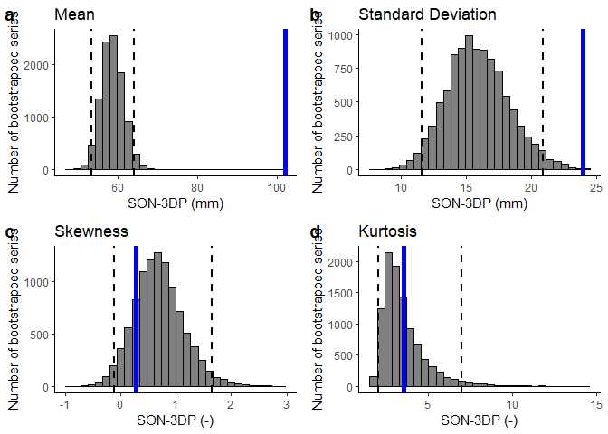
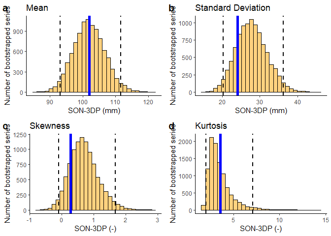
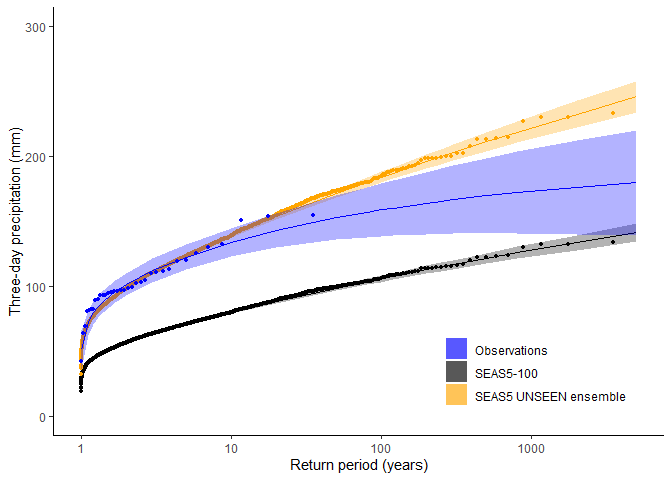
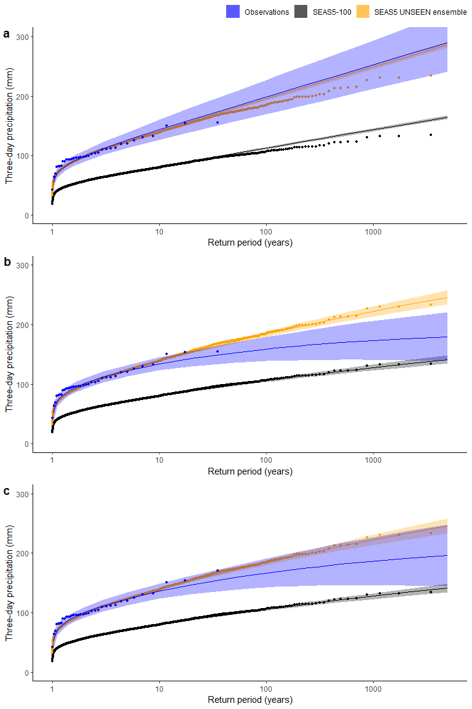

Model Fidelity
================
Timo Kelder
October 19, 2019

In this notebook, we assess the model fidelity of the SEAS5 UNSEEN
ensemble over the Norwegian West Coast compared to observed values. We
start by bootstrapping the ensemble and then compare the extreme value
distributions for both. For specifics, please see the paper.

## Import data and packages

``` r
# dir='//home/timok/timok/SALIENSEAS/SEAS5/ensex'
# plotdir=paste0(dir,'/statistics/multiday/plots')
# dir='/home/timok/ensex'
# plotdir='/home/timok/Documents/ensex/R/graphs'
dir='C:/Users/gytk3/OneDrive - Loughborough University/GitHub/EnsEx/Data'

source('Load_data.R')
```

    ## -- Attaching packages -------------------------------------------------------------------------------- tidyverse 1.3.0 --

    ## v tibble  2.1.3     v dplyr   0.8.3
    ## v tidyr   1.0.0     v stringr 1.4.0
    ## v readr   1.3.1     v forcats 0.4.0
    ## v purrr   0.3.3

    ## -- Conflicts ----------------------------------------------------------------------------------- tidyverse_conflicts() --
    ## x dplyr::arrange()   masks plyr::arrange()
    ## x purrr::compact()   masks plyr::compact()
    ## x dplyr::count()     masks plyr::count()
    ## x dplyr::failwith()  masks plyr::failwith()
    ## x dplyr::filter()    masks stats::filter()
    ## x dplyr::id()        masks plyr::id()
    ## x dplyr::lag()       masks stats::lag()
    ## x dplyr::mutate()    masks plyr::mutate()
    ## x dplyr::rename()    masks plyr::rename()
    ## x dplyr::summarise() masks plyr::summarise()
    ## x dplyr::summarize() masks plyr::summarize()

``` r
library(moments)
library(extRemes)
```

    ## Loading required package: Lmoments

    ## Loading required package: distillery

    ## 
    ## Attaching package: 'distillery'

    ## The following object is masked from 'package:plyr':
    ## 
    ##     is.formula

    ## 
    ## Attaching package: 'extRemes'

    ## The following objects are masked from 'package:stats':
    ## 
    ##     qqnorm, qqplot

``` r
library("ggpubr")
```

    ## Loading required package: magrittr

    ## 
    ## Attaching package: 'magrittr'

    ## The following object is masked from 'package:purrr':
    ## 
    ##     set_names

    ## The following object is masked from 'package:tidyr':
    ## 
    ##     extract

    ## 
    ## Attaching package: 'ggpubr'

    ## The following object is masked from 'package:plyr':
    ## 
    ##     mutate

``` r
require(plyr)
names(dimnames(Extremes_WC)) <- c('Member', 'Leadtime', 'Year')
names(dimnames(Extremes_SV)) <- c('Member', 'Leadtime', 'Year')
df_WC=adply(Extremes_WC, 1:3) ## Convert the array with extremes to a data frame 
df_SV=adply(Extremes_SV, 1:3)
obs=Extremes_obs[as.character(1981:2015)]
```

## Bootstrapping

From the [rank histograms](Rank_histograms.md), we’ve learned that the
raw forecast have a low bias. The anomalies show a flat rank histogram,
and therefore we select the mean bias correction as fixed value to
correct all values within the ensemble. This avoids extrapolation beyond
the quantile range. We show the sensitivity to using different quantiles
for this correction.

    ## [1] "We use the mean correction factor: 1.74074291686747"

    ## [1] "median: 1.72164167350046"

    ## [1] "5-year: 1.69100514636314"

    ## [1] "20-year: 1.70424526002514"

We then bootstrap the SEAS5-100 raw ensemble and the bias corrected
SEAS5 UNSEEN ensemble into timeseries of 35 years and compare the Mean,
Standard Deviation, skewness and kurtosis to the observed value.

``` r
#Bootstraps the series to 35 years length with n= 10.000 
bootstrapped_series_WC=sample(df_WC$V1,size = 35*10000,replace = T) #For WC
bootstrapped_series_WC_biascor=sample(extremes_wc_biascor,size = 35*10000,replace = T) #For WC
bootstrapped_array_WC=array(bootstrapped_series_WC,dim = c(35,10000)) #Creates an array with 10.000 series of 35 values
bootstrapped_array_WC_biascor=array(bootstrapped_series_WC_biascor,dim = c(35,10000)) #Same for the mean bias corrected series

plot_hist <- function(bootstrapped_array_WC,fun,main,col,units) {
  bootstrapped_fun=apply(bootstrapped_array_WC,MARGIN = 2,FUN = fun)
  ggplot()+
    geom_histogram(aes(x=bootstrapped_fun),color='black',fill=col,alpha=0.5,bins=30)+
    geom_vline(aes(xintercept=quantile(bootstrapped_fun,probs = c(0.025,0.975))),
              color="black", linetype="dashed", size=1)+
    geom_vline(aes(xintercept=fun(obs)),
              color="blue", size=2)+
    labs(title=main,y= 'Number of bootstrapped series',x =paste0("SON-3DP (",units,")"))+
    theme_classic()
    # theme(text=element_text(size=7,family='sans'))
}


p1=plot_hist(bootstrapped_array_WC,fun=mean,main = 'Mean',col='black',units = 'mm')
p2=plot_hist(bootstrapped_array_WC,sd,'Standard Deviation','black',units = 'mm')
p3=plot_hist(bootstrapped_array_WC,skewness,'Skewness','black',units = '-')
p4=plot_hist(bootstrapped_array_WC,kurtosis,'Kurtosis','black',units = '-')

p1_cor=plot_hist(bootstrapped_array_WC_biascor,mean,'Mean','orange',units = 'mm')
p2_cor=plot_hist(bootstrapped_array_WC_biascor,sd,'Standard Deviation','orange',units = 'mm')
p3_cor=plot_hist(bootstrapped_array_WC_biascor,skewness,'Skewness','orange',units = '-')
p4_cor=plot_hist(bootstrapped_array_WC_biascor,kurtosis,'Kurtosis','orange',units = '-')

ggarrange(p1,p2,p3,p4,
          labels = c("a", "b","c","d"),
          ncol = 2, nrow = 2)#%>%
```

<!-- -->

``` r
    #ggsave(filename = "../graphs/Fidelity_UNSEEN.pdf",width =180,height = 180, units='mm',dpi=300)
# 
ggarrange(p1_cor,p2_cor,p3_cor,p4_cor,
          labels = c("a", "b","c","d"),
          ncol = 2, nrow = 2)#%>%
```

<!-- -->

``` r
   # ggsave(filename = "../graphs/Fidelity_UNSEEN_biascor.pdf",width =180,height = 180, units='mm',dpi=300)
```

### Return value comparison

We fit the GEV distribution to the simulated and to the observed data.
The parameters of the distribution are the location (mean), scale
(variation) and shape (shape of the distribution).

``` r
###Highest extreme possible in comparison to observed?
print(paste('Highest extreme possible in comparison to observed:', as.character(max(extremes_wc_biascor)/max(obs))))
```

    ## [1] "Highest extreme possible in comparison to observed: 1.5090235370347"

``` r
EVT_plot <- function(obs=obs,GEV_type) {
  ##Fit GEV to 1) observed 2) raw SEAS5 3) mean bias corrected SEAS5
  fit_obs <- fevd(x = obs, threshold = NULL, threshold.fun = ~1, location.fun = ~1,
      scale.fun = ~1, shape.fun = ~1, use.phi = FALSE,
      type = GEV_type,method = "MLE", initial = NULL, #type= c("GEV", "GP", "PP", "Gumbel", "Exponential"), method= c("MLE", "GMLE", "Bayesian", "Lmoments")
      span=NULL, units = NULL, time.units = "days", period.basis = "year", ## time and period only important for labelling and do not influence the calculation
      na.action = na.fail, optim.args = NULL, priorFun = NULL,
      priorParams = NULL, proposalFun = NULL, proposalParams = NULL,
      iter = 9999, weights = 1, blocks = NULL, verbose = FALSE) 
  
  #### fit_obs <- fevd(x = obs) is the same thing
  
  fit_Seas5 <- fevd(x = df_WC$V1,type=GEV_type)
  fit_Seas5_biascorr <- fevd(x = extremes_wc_biascor,type=GEV_type)
  
  ##Now calculate the return levels and their confidence intervals for each return period within rperiods
  rperiods = c(seq(from = 1.01, to = 1.5, by =0.1),1.7,2,3, 5, 10, 20, 50, 80, 100, 120, 200, 250, 300, 500, 800,2000,5000)
  
  ############### cHECK WHETHER THE BOOT GOES ALRIGHT
  
  rvs_obs=ci.fevd(fit_obs,alpha = 0.05,type='return.level',return.period = rperiods,method ="normal") 
  colnames(rvs_obs) = c('Obs_l','Obs','Obs_h') #Rename the col
  rvs_Seas5=ci.fevd(fit_Seas5,alpha = 0.05,type='return.level',return.period = rperiods,method ="normal")
  colnames(rvs_Seas5) = c('S5_l','S5','S5_h') #Rename the column
  rvs_Seas5_biascorr=ci.fevd(fit_Seas5_biascorr,alpha = 0.05,type='return.level',return.period = rperiods,method ="normal")
  colnames(rvs_Seas5_biascorr) = c('S5_corrected_l','S5_corrected','S5_corrected_h') #Rename the column
  
  rvs_WC_stationair=data.frame(cbind(rvs_obs,rvs_Seas5,rvs_Seas5_biascorr,rperiods)) ##Make a datafram for ggplot
  
  ##We want to add the empirical data
  rp_obs=35/1:35## these are the (empirical) return periods for the sorted datapoints
  obs_sorted=sort(obs,decreasing = T)##For example, the highest extreme has a rp of 35 years, the second highest 17.5, third highest 11.7 etc.
  datapoints_obs=data.frame(cbind(rp_obs,obs_sorted))
  
  rp_S5=35*25*4/1:(35*25*4) #SEAS5 has return periods up to 3500 years
  S5_raw_sorted=sort(df_WC$V1,decreasing = T) 
  S5_corrected_sorted=sort(extremes_wc_biascor,decreasing = T)
  datapoints_S5=data.frame(cbind(rp_S5,S5_raw_sorted,S5_corrected_sorted,obs_sorted))
  
  ##And plot
  cols=c("SEAS5-100"="black","SEAS5 UNSEEN ensemble"="orange","Observations"="blue") ##for  the legend
  p1=ggplot(data = rvs_WC_stationair,aes(x=rperiods))+
    geom_line(aes(y = S5),col='black')+
    geom_ribbon(aes(ymin=S5_l,ymax=S5_h,fill="SEAS5-100"),alpha=0.3)+
    geom_point(data=datapoints_S5,aes(x=rp_S5,y = S5_raw_sorted),col='black',size=1)+
    geom_line(aes(y = S5_corrected),col='orange')+
    geom_ribbon(aes(ymin=S5_corrected_l,ymax=S5_corrected_h,fill='SEAS5 UNSEEN ensemble'), alpha=0.3)+
    geom_point(data=datapoints_S5,aes(x=rp_S5,y = S5_corrected_sorted),col='orange',size=1)+
    geom_line(aes(y = Obs),col='blue')+
    geom_ribbon(aes(ymin=Obs_l,ymax=Obs_h,fill='Observations'), alpha=0.3)+
    geom_point(data=datapoints_obs,aes(x=rp_obs,y = obs_sorted),col='blue', size=1)+
    scale_x_continuous(trans='log10')+
    scale_fill_manual(name="Data",values=cols) +
    theme_classic()+
    theme(legend.position = c(.95, .05),
      legend.justification = c("right", "bottom"),
      legend.box.just = "right",
      legend.title = element_blank())+
    xlab('Return period (years)')+
    ylab('Three-day precipitation (mm)')+
    coord_cartesian(ylim = c(0, 300)) 

  return(p1)
    
}

p1=EVT_plot(obs=obs,GEV_type = 'GEV')
# ggsave(p1,filename = "../graphs/Fidelity_EVT.png")#,width =180,height = 180, units='mm',dpi=300)
p1
```

<!-- -->

``` r
p2=EVT_plot(obs=obs,GEV_type = 'Gumbel')

obs_test <- obs
obs_test['2005'] <- obs['2005']*1.1

p3=EVT_plot(obs=obs_test,GEV_type = 'GEV')


ggarrange(p2, p1,p3,
          labels = c("a", "b","c"),
          ncol = 1, nrow = 3,
          common.legend = TRUE) #%>%
```

<!-- -->

``` r
# ggsave(filename = "../graphs/Fidelity_sensitivity.png",width =8,height = 12 )
# ggsave(p2,filename = "../graphs/Fidelity_Gumbel.png")
# ggsave(p3,filename = "../graphs/Fidelity_obs_adjusted.png")
```
