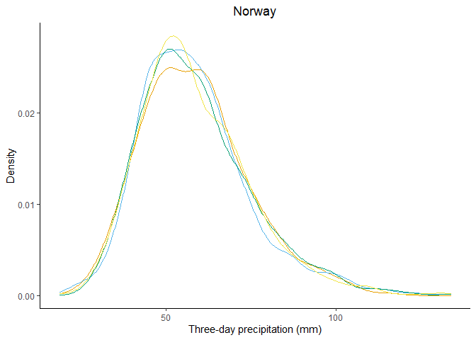
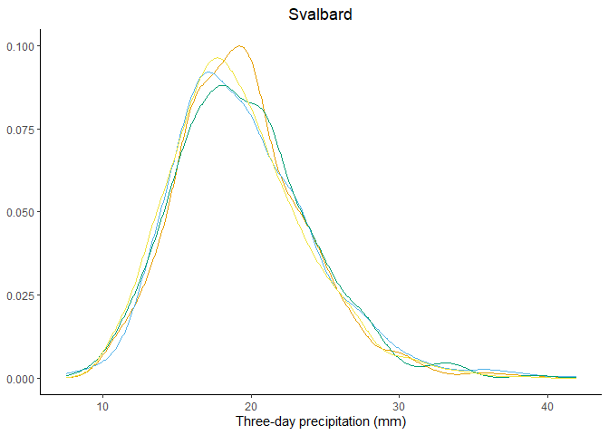
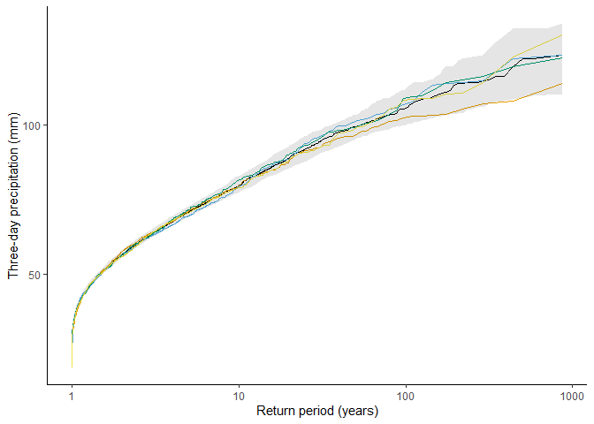
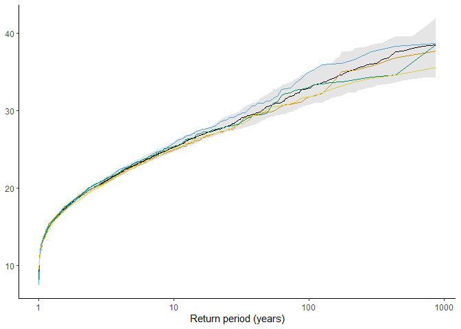
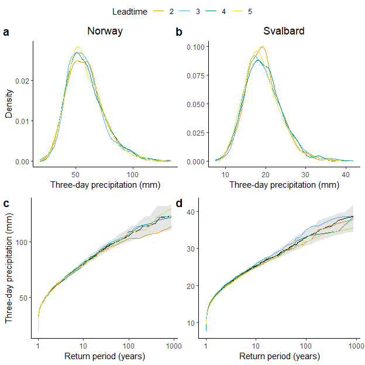

Model stability
================
Timo Kelder
November 12, 2019

In this notebook, we assess the stability of the model over forecast
length. Does the statistical distribution of extreme precipitation
increase (or decrease) with longer lead times? We assess the
distribution of extreme precipitation between different forecast lead
times. The extremes are defined as the maxima three-day precipitation
values.

## Import data and packages

``` r
# dir_lustre='//home/timok/timok/SALIENSEAS/SEAS5/ensex'
# plotdir_lustre=paste0(dir,'/statistics/multiday/plots')
# dir_Norlaptop='/home/timok/Documents/ensex'
# plotdir_Norlaptop='/home/timok/Documents/ensex/R/graphs'
# dir_Perslaptop='C:/Users/Timo/Documents/GitHub/EnsEx/Data'
# plotdir_Perslaptop='/home/timok/Documents/ensex/R/graphs'
# dir='/home/timok/Documents/ensex/EnsEx/Data'
# plotdir='/home/timok/Documents/ensex/R/graphs'
dir='C:/Users/gytk3/OneDrive - Loughborough University/GitHub/EnsEx/Data'

source('Load_data.R')
library("ggpubr")
```

## Plot empirical cumulative distribution functions for each leadtime

We show the probability density for the west coast of Norway and for
Svalbard. The lead times seem very similar.

``` r
## A list with directories used

require(plyr)
names(dimnames(Extremes_WC)) <- c('Member', 'Leadtime', 'Year')
names(dimnames(Extremes_SV)) <- c('Member', 'Leadtime', 'Year')
df_WC=adply(Extremes_WC, 1:3) ## Convert the array with extremes to a data frame 
df_SV=adply(Extremes_SV, 1:3)
```

``` r
#Colorblind friendly palette with grey:
cbbPalette <- c("#E69F00", "#56B4E9", "#009E73", "#F0E442","#000000")

p1=ggplot(df_WC, aes(x = V1, colour = Leadtime)) +
  ggtitle("Norway") +
  labs(x = 'Three-day precipitation (mm)',y = 'Density')+
  geom_line(stat='density')+
  theme_classic()+
  theme(legend.position = "none")+
  scale_colour_manual(values=cbbPalette)

p2=ggplot(df_SV, aes(x = V1, colour = Leadtime)) +
  ggtitle("Svalbard") +
  labs(x = 'Three-day precipitation (mm)')+
  geom_line(stat='density')+
  theme_classic()+
  theme(legend.position = "none",
      axis.title.y=element_blank())+
  scale_colour_manual(values=cbbPalette)


p1
```

<!-- -->

``` r
p2
```

<!-- -->

``` r
# ggsave(p2, filename = paste0(dir,"/statistics/multiday/plots/Stability.png"), dpi = 100, type = "cairo")
```

We want to show the confidence interval of the distribution of all lead
times pooled together, and test whether the individual lead times fall
within these confidence intervals. Therefore we bootstrap the pooled
leadtimes into series with equal length of the individual leadtimes
(875), with n=10000.

``` r
bootstrapped_series_SV=sample(df_SV$V1,size = 875*10000,replace = T) #bootstraps the series of length equal to each lead time (875) with n= 10.000 
bootstrapped_series_WC=sample(df_WC$V1,size = 875*10000,replace = T) #Same for WC
bootstrapped_array_SV=array(bootstrapped_series_SV,dim = c(875,10000)) #Creates an array with 10.000 series of 875 values
bootstrapped_array_WC=array(bootstrapped_series_WC,dim = c(875,10000)) #Creates an array with 10.000 series of 875 values

CI <- function(x) {
quantile(x,probs=c(0.025,0.975))  ##lower and upper interval
}  
```

We plot the empirical return values of the pooled ensemble including
confidence intervals. On top, we add the individual lead times.

``` r
rps=35*25*4/1:(35*25*4) #The return periods for the entire ensemble of 3500 years
rps_ld = 35*25/1:(35*25) #The return periods for the ensemble split up into 4 leadtimes, 875 years

empirical_returnvalues <- function(x) { ##write a function to obtain the quantiles for the distribution  
  return(quantile(x,probs = 1-1/(rps))) #returns the quantiles for the return values = (1-1/return period)
}

Rvs_WC=apply(bootstrapped_array_WC, MARGIN = 2,empirical_returnvalues) #apply the function to each of the 10.000 series
Rvs_SV=apply(bootstrapped_array_SV, MARGIN = 2,empirical_returnvalues) #Same for Svalbard

#calculate the lower and upper interval from the 10.000 values for each quantile. 
ci_rvs_WC=apply(Rvs_WC, MARGIN = 1,CI)
ci_rvs_SV=apply(Rvs_SV, MARGIN = 1,CI)
# png(paste0('//home/timok/timok/SALIENSEAS/SEAS5/ensex/statistics/multiday/plots/Stability_rv.png'),type='cairo')

##Create a dataframe including the return peridos, empirical values and confidence intervals
df_quantiles_wc <-df_WC %>% 
  mutate(rps_all=rps,quantiles_all=quantile(V1,1-1/(rps)))

df_quantiles_wc <- df_quantiles_wc %>% 
  group_by(Leadtime) %>% 
  mutate(rps_ld=rps_ld,quantiles_ld=quantile(V1,1-1/(rps_ld)))

df_quantiles_wc$ci_2.5 <- ci_rvs_WC[1,]
df_quantiles_wc$ci_97.5 <- ci_rvs_WC[2,]

##Same for Svalbard
df_quantiles_sv <-df_SV %>% 
  mutate(rps_all=rps,quantiles_all=quantile(V1,1-1/(rps)))

df_quantiles_sv <- df_quantiles_sv %>% 
  group_by(Leadtime) %>% 
  mutate(rps_ld=rps_ld,quantiles_ld=quantile(V1,1-1/(rps_ld)))

df_quantiles_sv$ci_2.5 <- ci_rvs_SV[1,]
df_quantiles_sv$ci_97.5 <- ci_rvs_SV[2,]
```

``` r
#And plot!
cols=c("95 % CI"="black")
p3=ggplot(df_quantiles_wc)+
  geom_line(aes(x=rps_all,y=quantiles_all))+
  geom_line(aes(x=rps_ld,y=quantiles_ld,col=Leadtime))+
  geom_ribbon(aes(x=rps_all,ymin=ci_2.5,ymax=ci_97.5,fill="95 % CI"),alpha=0.1)+
  # xlim(NA,875)+
  scale_x_log10(limits=c(NA,875))+
  # scale_x_continuous(trans='log10') +
  theme_classic()+
  theme(legend.position = "none")+
  scale_fill_manual(name="Pooled data",values=cols) +
  scale_colour_manual(values=cbbPalette)+
  xlab('Return period')+
  ylab('Three-day precipitation (mm)')

p4=ggplot(df_quantiles_sv)+
  geom_line(aes(x=rps_all,y=quantiles_all))+
  geom_line(aes(x=rps_ld,y=quantiles_ld,col=Leadtime))+
  geom_ribbon(aes(x=rps_all,ymin=ci_2.5,ymax=ci_97.5,fill="95 % CI"),alpha=0.1)+
  # xlim(NA,875)+
  scale_x_log10(limits=c(NA,875))+
  # scale_x_continuous(trans='log10') +
  scale_fill_manual(name="Pooled data",values=cols) +
  scale_colour_manual(values=cbbPalette)+
  theme_classic()+
  theme(axis.title.y=element_blank(),
    legend.position = "none")+
    # c(.95, .05),
    # legend.justification = c("right", "bottom"),
    # legend.box.just = "right")+
  guides(fill = FALSE)+
  xlab('Return period')+
  ylab('Three-day precipitation (mm)')

p3
```

    ## Warning: Removed 3 rows containing missing values (geom_path).

<!-- -->

``` r
p4
```

    ## Warning: Removed 3 rows containing missing values (geom_path).

<!-- -->

And then combined

``` r
#Combine the plots
ggarrange(p1, p2, p3,p4, 
          labels = c("A", "B", "C", "D"),
          ncol = 2, nrow = 2)
```

    ## Warning: Removed 3 rows containing missing values (geom_path).
    
    ## Warning: Removed 3 rows containing missing values (geom_path).

<!-- -->

``` r
ggarrange(p1, p2, p3,p4, 
        labels = c("A", "B", "C", "D"),
        hjust = c(-0.5,1,-0.5,1),
        ncol = 2, nrow = 2,
        common.legend = TRUE) #%>% 
```

    ## Warning: Removed 3 rows containing missing values (geom_path).
    
    ## Warning: Removed 3 rows containing missing values (geom_path).

<!-- -->

``` r
 # ggsave(filename = "../graphs/Stability.png", width = 6.5, height = 6.5)
```
