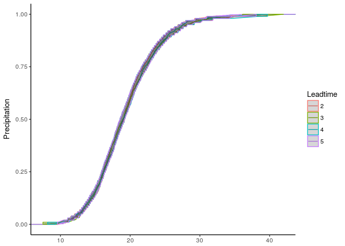

Model stability
================
Timo Kelder
November 12, 2019

Import data and packages
------------------------

``` r
dir='//home/timok/timok/SALIENSEAS/SEAS5/ensex'
plotdir=paste0(dir,'/statistics/multiday/plots')
# dir='/home/timok/ensex'
# plotdir='/home/timok/Documents/ensex/R/graphs'
source('Load_data.R')
```

    ## ── Attaching packages ────────────────────────────────── tidyverse 1.2.1 ──

    ## ✔ tibble  2.1.3     ✔ purrr   0.3.3
    ## ✔ tidyr   1.0.0     ✔ dplyr   0.8.3
    ## ✔ readr   1.1.1     ✔ stringr 1.3.0
    ## ✔ tibble  2.1.3     ✔ forcats 0.3.0

    ## ── Conflicts ───────────────────────────────────── tidyverse_conflicts() ──
    ## ✖ dplyr::arrange()   masks plyr::arrange()
    ## ✖ purrr::compact()   masks plyr::compact()
    ## ✖ dplyr::count()     masks plyr::count()
    ## ✖ dplyr::failwith()  masks plyr::failwith()
    ## ✖ dplyr::filter()    masks stats::filter()
    ## ✖ dplyr::id()        masks plyr::id()
    ## ✖ dplyr::lag()       masks stats::lag()
    ## ✖ dplyr::mutate()    masks plyr::mutate()
    ## ✖ dplyr::rename()    masks plyr::rename()
    ## ✖ dplyr::summarise() masks plyr::summarise()
    ## ✖ dplyr::summarize() masks plyr::summarize()

Plot empirical cumulative distribution functions for each leadtime
------------------------------------------------------------------

``` r
require(plyr)
names(dimnames(Extremes_WC)) <- c('Member', 'Leadtime', 'Year')
names(dimnames(Extremes_SV)) <- c('Member', 'Leadtime', 'Year')
df_WC=adply(Extremes_WC, 1:3)
df_SV=adply(Extremes_SV, 1:3)

ggplot(df_WC, aes(V1, colour = Leadtime)) + stat_ecdf() +labs(x = NULL, y = 'Precipitation')+
  theme_classic() 
```


``` r
ggplot(df_SV, aes(V1, colour = Leadtime)) + stat_ecdf() +labs(x = 'Precipitation')+
  theme_classic() 
```


``` r
p2=ggplot(df_SV, aes(x = V1, fill = Leadtime)) +
  labs(x = 'Precipitation')+
  geom_density(alpha = .3)+
  theme_classic()
ggsave(p2, filename = paste0(dir,"/statistics/multiday/plots/Stability.png"), dpi = 100, type = "cairo")
```

    ## Saving 7 x 5 in image

``` r
bootstrapped_series=sample(df_SV$V1,size = 875*10000,replace = T) #bootstraps the series of length equal to each lead time (875) with n= 10.000 
bootstrapped_array=array(bootstrapped_series,dim = c(875,10000)) #Creates an array with 10.000 series of 875 values

##Here I dont know how to get the 5 and 95% confidence intervals for the ecdf from the 10.000 series. Now, I calculate the quantiles over the ecdf for each of the series, and then calculate the lower and upper interval for the quantiles over the 10.000 values. 
ecdf_datavalues <- function(x) { ##write a function to obtain the quantiles for the ecdf distribution  
  b=ecdf(x)
  return(quantile(b,probs = seq(0,1,0.01))) #returns the quantiles for the empirical distribution
}

a=apply(bootstrapped_array, MARGIN = 2,ecdf_datavalues) #apply the ecdf function to each of the 10.000 series

CI <- function(x) {
quantile(x,probs=c(0.05,0.95))  ##lower and upper interval
}  

#calculate the lower and upper interval from the 10.000 values for each quantile. The  
ci=apply(a, MARGIN = 1,CI)

lower=ecdf(ci[1,])
upper=ecdf(ci[2,])

p2=ggplot(df_SV, aes(V1, colour = Leadtime)) + stat_ecdf() +labs(x = NULL, y = 'Precipitation')+ 
  geom_ribbon(aes(x=df_SV$V1,ymin = lower(df_SV$V1),ymax = upper(df_SV$V1)),alpha = 0.2)+
  theme_classic()
ggsave(p2, filename = paste0(dir,"/statistics/multiday/plots/Stability.png"), dpi = 100, type = "cairo")
```

    ## Saving 7 x 5 in image

``` r
###I cant do it with ggplot..
```

So Lets try base R..

``` r
#Try base R
bootstrapped_series=sample(df_WC$V1,size = 875*10000,replace = T) #bootstraps the series of length equal to each lead time (875) with n= 10.000 
bootstrapped_array=array(bootstrapped_series,dim = c(875,10000)) #Creates an array with 10.000 series of 875 values
ecdfs_WC=apply(bootstrapped_array, MARGIN = 2,ecdf_datavalues) #apply the ecdf function to each of the 10.000 series
#calculate the lower and upper interval from the 10.000 values for each quantile. The  
ci_WC=apply(ecdfs_WC, MARGIN = 1,CI)


# png(paste0('//home/timok/timok/SALIENSEAS/SEAS5/ensex/statistics/multiday/plots/Drift_WC_ecdf.png'),type='cairo')
par(mar=c(4.5,5.1,2.1,2.1),cex.axis=1.5, cex.lab=1.5,cex.main=1.5)

#Plot the ecdf for the first lead time
plot(ecdf(as.vector(Extremes_WC[,'2',])), 
     col=2,
     xlab="Seasonal maximum daily precipitation (mm)",
     ylab="Cumulative Proportion",
     cex=0)
##Add the other three
for (ld in 3:5){
  lines(ecdf(as.vector(Extremes_WC[,as.character(ld),])),col=ld,cex=0)
}

#And add the confidence intervals
lines(ecdf(ci_WC[1,]), do.points=F,lty=2,col='grey')
lines(ecdf(ci_WC[2,]), do.points=F,lty = 2,col='grey')

legend('bottomright',
       legend=as.character(2:5),  # text in the legend
       col=2:5,  # point colors
       lty=1,
       cex=1.3,
       bg='white')  # specify the point type to be a square
```



``` r
# dev.off()
```
