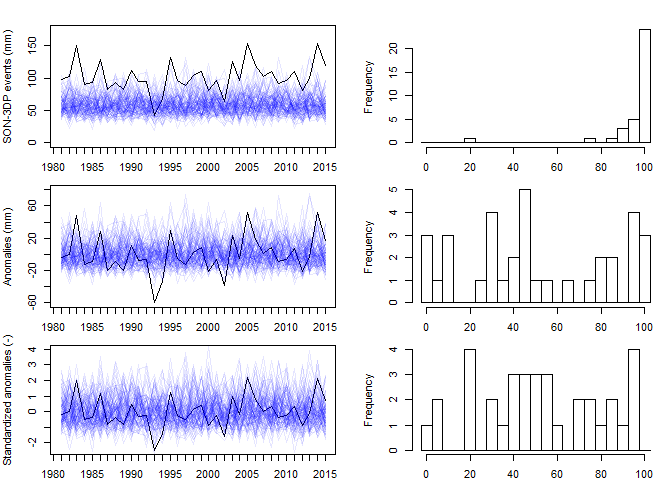

Rank histograms
================
Timo Kelder
October 19, 2019

In this notebook, we show the forecasts of the Norwegian West Coast
compared to observed values.

## Import data and packages

``` r
# dir='//home/timok/timok/SALIENSEAS/SEAS5/ensex'
# plotdir=paste0(dir,'/statistics/multiday/plots')
# dir='/home/timok/ensex'
# plotdir='/home/timok/Documents/ensex/R/graphs'
dir='C:/Users/gytk3/OneDrive - Loughborough University/GitHub/EnsEx/Data'
source('Load_data.R')
```

    ## -- Attaching packages -------------------------------------------------------------------------------- tidyverse 1.3.0 --

    ## v tibble  2.1.3     v dplyr   0.8.3
    ## v tidyr   1.0.0     v stringr 1.4.0
    ## v readr   1.3.1     v forcats 0.4.0
    ## v purrr   0.3.3

    ## -- Conflicts ----------------------------------------------------------------------------------- tidyverse_conflicts() --
    ## x dplyr::arrange()   masks plyr::arrange()
    ## x purrr::compact()   masks plyr::compact()
    ## x dplyr::count()     masks plyr::count()
    ## x dplyr::failwith()  masks plyr::failwith()
    ## x dplyr::filter()    masks stats::filter()
    ## x dplyr::id()        masks plyr::id()
    ## x dplyr::lag()       masks stats::lag()
    ## x dplyr::mutate()    masks plyr::mutate()
    ## x dplyr::rename()    masks plyr::rename()
    ## x dplyr::summarise() masks plyr::summarise()
    ## x dplyr::summarize() masks plyr::summarize()

## SEAS5 compared to SeNorge

Plot the observations and the forecasts for:

  - The raw values for the observations and the forecasts
  - The anomalies
  - The standardized anomalies

First, we define some functions

``` r
rank.histogram <- function(pred,obs=NULL) {
  
  N <- dim(pred)[2]
  K <- dim(pred)[1]
  
  ranks <- apply(rbind(obs, pred), 2, rank, ties.method="random")[1, ]
  rank.hist <- hist(ranks, breaks=seq(-2.5, K+2.5,5),main=NULL)[["counts"]]
}

pred=apply(Extremes_WC,MARGIN = c(1,2) , FUN=calc_anomaly)

rank.histogram3 <- function(pred,obs=NULL) {
  N <- dim(pred)[1]
  K <- dim(pred)[2]
  
  ranks <- apply(cbind(obs, pred), 1, rank, ties.method="random")[1, ]
  rank.hist <- hist(ranks, breaks=seq(-2.5, K+2.5,5),main=NULL)[["counts"]]
}
```

To compare the obervation with the simulations, we show the rank
histogram for each of the three plots. The rank histograms illustrates
on what rank the observations lie compared to all forecasts. If the
simulations are not biased and represent plausible realizations of
reality, the observations would be randomly distributed over the range
of simulations and the rank histogram would be flat.

From both the time series and histogram plots, it is clear that the
forecast have a lower bias. When corrected for this mean bias, the ranks
of the observations seem to be equally distributed over the forecast
ranks.

``` r
##Plot
# png('../graphs/Rank_hist.png', width = 6, height = 6, units = 'in', res = 300)
par(mfrow=c(3,2),mar=c(1,4,2,0))
plot(1981:2015,predictand,type='l',ylim=c(0,175), ylab = 'SON-3DP events (mm)',xlab = '')
for (mbr in 1:25){
  for (ld in 1:4){
    lines(1981:2015,Extremes_WC[mbr,ld,],col=alpha('blue',0.1))}}
axis(side = 1,1981:2015,labels = F)

par(mar=c(1,6,2,1))

rank1=rank.histogram(rbind(Extremes_WC[,1,],Extremes_WC[,2,],Extremes_WC[,3,],Extremes_WC[,4,]),predictand)

par(mar=c(1,4,2,0))

plot(1981:2015,predictand-mean(predictand),type='l',ylim=c(-60,80),ylab = 'Anomalies (mm)',xlab = '')
for (mbr in 1:25){
  for (ld in 1:4){
    lines(1981:2015,Extremes_WC[mbr,ld,]-mean(Extremes_WC),col=alpha('blue',0.1))}}
axis(side = 1,1981:2015,labels = F)


par(mar=c(1,6,2,1))

rank2=rank.histogram(rbind(Extremes_WC[,1,],Extremes_WC[,2,],Extremes_WC[,3,],Extremes_WC[,4,])-mean(Extremes_WC),predictand-mean(predictand))

par(mar=c(2,4,2,0))

plot(1981:2015,predictand_anomaly,type='l',ylim = c(-2.5,4),ylab='Standardized anomalies (-)',xlab = '')
for (mbr in 1:25){
  for (ld in 1:4){
    lines(1981:2015,calc_anomaly(Extremes_WC[mbr,ld,]),col=alpha('blue',0.1))}}
axis(side = 1,1981:2015,labels = F)

par(mar=c(2,6,2,1))

rank3=rank.histogram3(cbind(pred[,,1],pred[,,2],pred[,,3],pred[,,4]),predictand_anomaly)
```

<!-- -->

``` r
# dev.off()
```
