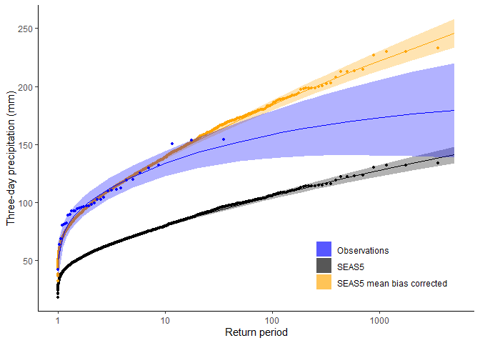
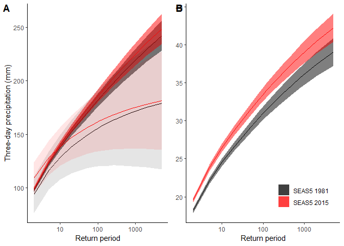
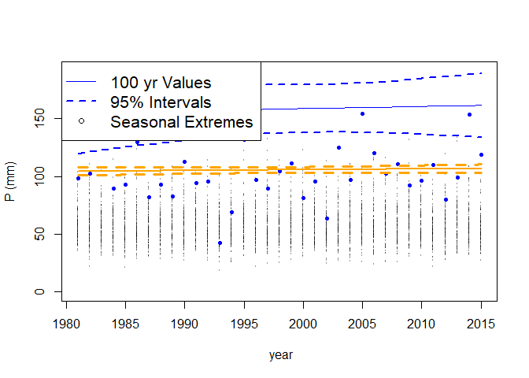
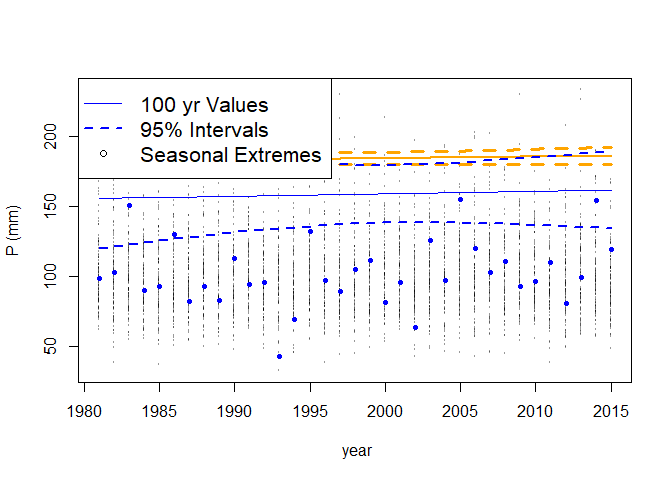
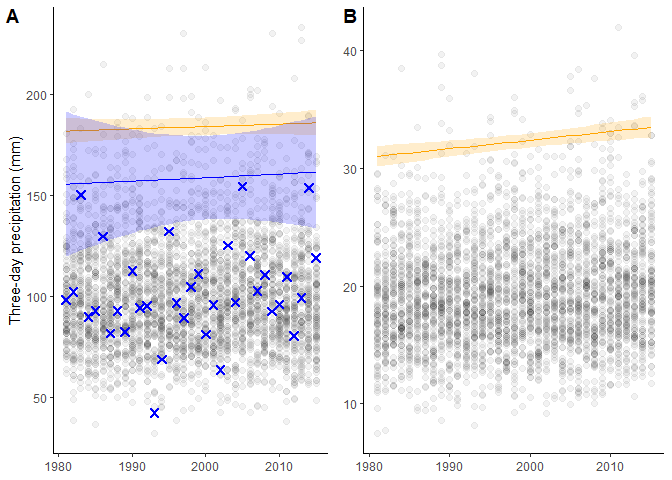

Trend analysis
================
Timo Kelder
November 13, 2019

In this notebook, we are going to perform trend analysis based on extreme value theory. First, we will assess for the West Coast of Norway, how the simulated return values compare to observed return values. Then we will quantify the trend in the 100-year precipitation extremes over time (1981-2015) for the West Coast region and for Svalbard.

### Import data and packages

The data for the West coast and Svalbard are loaded.

``` r
# dir='//home/timok/timok/SALIENSEAS/SEAS5/ensex'
# plotdir=paste0(dir,'/statistics/multiday/plots')
# dir='/home/timok/Documents/ensex'
# plotdir='/home/timok/Documents/ensex/R/graphs'
dir='C:/Users/Timo/Documents/GitHub/EnsEx/Data'
plotdir='/home/timok/Documents/ensex/R/graphs'
source('Load_data.R')
library(extRemes)
library("ggpubr")

##Clean up and compare to load_Data
names(dimnames(Extremes_WC)) <- c('Member', 'Leadtime', 'Year')
names(dimnames(Extremes_SV)) <- c('Member', 'Leadtime', 'Year')
df_WC=adply(Extremes_WC, 1:3)
df_SV=adply(Extremes_SV, 1:3)
obs=Extremes_obs[as.character(1981:2015)]

year_vector=as.numeric(levels(df_WC$Year))[df_WC$Year] ###The year is a factor, extract the values  
```

### Return value comparison

We fit the GEV distribution to the simulated and to the observed data. The parameters of the distribution are the location (mean), scale (variation) and shape (shape of the distribution).

``` r
extremes_wc= df_WC$V1 * mean(obs)/mean(df_WC$V1) ## we create a mean bias corrected series  

##Fit GEV to 1) observed 2) raw SEAS5 3) mean bias corrected SEAS5
fit_obs <- fevd(x = obs, threshold = NULL, threshold.fun = ~1, location.fun = ~1,
    scale.fun = ~1, shape.fun = ~1, use.phi = FALSE,
    type = "GEV",method = "MLE", initial = NULL, #type= c("GEV", "GP", "PP", "Gumbel", "Exponential"), method= c("MLE", "GMLE", "Bayesian", "Lmoments")
    span=NULL, units = NULL, time.units = "days", period.basis = "year", ## time and period only important for labelling and do not influence the calculation
    na.action = na.fail, optim.args = NULL, priorFun = NULL,
    priorParams = NULL, proposalFun = NULL, proposalParams = NULL,
    iter = 9999, weights = 1, blocks = NULL, verbose = FALSE) 

#### fit_obs <- fevd(x = obs) is the same thing

fit_Seas5 <- fevd(x = df_WC$V1)
fit_Seas5_biascorr <- fevd(x = extremes_wc)

##Now calculate the return levels and their confidence intervals
rperiods = c(seq(from = 1.01, to = 1.5, by =0.1),1.7,2,3, 5, 10, 20, 50, 80, 100, 120, 200, 250, 300, 500, 800,2000,5000)

rvs_obs=ci.fevd(fit_obs,alpha = 0.05,type='return.level',return.period = rperiods,method ="normal") 
colnames(rvs_obs) = c('Obs_l','Obs','Obs_h') #Rename the col
rvs_Seas5=ci.fevd(fit_Seas5,alpha = 0.05,type='return.level',return.period = rperiods,method ="normal")
colnames(rvs_Seas5) = c('S5_l','S5','S5_h') #Rename the column
rvs_Seas5_biascorr=ci.fevd(fit_Seas5_biascorr,alpha = 0.05,type='return.level',return.period = rperiods,method ="normal")
colnames(rvs_Seas5_biascorr) = c('S5_corrected_l','S5_corrected','S5_corrected_h') #Rename the column

rvs_WC_stationair=data.frame(cbind(rvs_obs,rvs_Seas5,rvs_Seas5_biascorr,rperiods))

rp_obs=35/1:35## these are the (empirical) return periods for the sorted datapoints
obs_sorted=sort(obs,decreasing = T)##For example, the highest extreme has a rp of 35 years, the second highest 17.5, third highest 11.7 etc.
datapoints_obs=data.frame(cbind(rp_obs,obs_sorted))

rp_S5=35*25*4/1:(35*25*4) 
S5_raw_sorted=sort(df_WC$V1,decreasing = T) 
S5_corrected_sorted=sort(extremes_wc,decreasing = T)
datapoints_S5=data.frame(cbind(rperiods,S5_raw_sorted,S5_corrected_sorted,obs_sorted))
```

    ## Warning in cbind(rperiods, S5_raw_sorted, S5_corrected_sorted, obs_sorted):
    ## number of rows of result is not a multiple of vector length (arg 1)

``` r
cols=c("SEAS5"="black","SEAS5 mean bias corrected"="orange","Observations"="blue") 
ggplot(data = rvs_WC_stationair,aes(x=rperiods))+
  geom_line(aes(y = S5),col=1)+
  geom_ribbon(aes(ymin=S5_l,ymax=S5_h,fill="SEAS5"),alpha=0.3)+
  geom_point(data=datapoints_S5,aes(x=rp_S5,y = S5_raw_sorted),col=1,size=1)+
  geom_line(aes(y = S5_corrected),col='orange')+
  geom_ribbon(aes(ymin=S5_corrected_l,ymax=S5_corrected_h,fill='SEAS5 mean bias corrected'), alpha=0.3)+
  geom_point(data=datapoints_S5,aes(x=rp_S5,y = S5_corrected_sorted),col='orange',size=1)+
  geom_line(aes(y = Obs),col='blue')+
  geom_ribbon(aes(ymin=Obs_l,ymax=Obs_h,fill='Observations'), alpha=0.3)+
  geom_point(data=datapoints_obs,aes(x=rp_obs,y = obs_sorted),col='blue', size=1)+
  scale_x_continuous(trans='log10')+
  scale_fill_manual(name="Data",values=cols) +
  theme_classic()+
  theme(legend.position = c(.95, .05),
    legend.justification = c("right", "bottom"),
    legend.box.just = "right",
    legend.title = element_blank())+
  xlab('Return period')+
  ylab('Three-day precipitation (mm)')
```



``` r
length(df_WC$V1)
```

    ## [1] 3500

``` r
length(35*25*4/1:(35*25*4))
```

    ## [1] 3500

And then we compare the 1981 and 2016 return value plots for SEAS5

``` r
rperiods = c(2, 5, 10, 20, 50, 80, 100, 120, 200, 250, 300, 500, 800,2000,5000)

RV_ci <- function(extremes,covariate,return_period,covariate_values) { ## A function to fit the GEV and obtain the return values 
  fit <- fevd(extremes, location.fun = ~ covariate, ##Fitting the gev with a location and scale parameter linearly correlated to the covariate (years)
               scale.fun = ~ covariate, use.phi = TRUE)

  params_matrix <- make.qcov(fit, vals = list(mu1 = covariate_values,phi1 = covariate_values)) #Create a parameter matrix for the GEV fit
  rvs=ci.fevd(fit,alpha = 0.05,type='return.level',return.period = return_period,method ="normal",qcov=params_matrix)  #Calculate the return values and confidence intervals for each year   
  return(rvs)
}

rvs_wc_1981=RV_ci(extremes = extremes_wc,covariate = c(df_WC$Year),return_period = rperiods,covariate_values = 1) ##calc the return values
colnames(rvs_wc_1981) = c('S5_1981_l','S5_1981','S5_1981_h','S5_1981_sd') #Rename the column

rvs_wc_2015=RV_ci(extremes = extremes_wc,covariate = c(df_WC$Year),return_period = rperiods,covariate_values = 35)
colnames(rvs_wc_2015) = c('S5_2015_l','S5_2015','S5_2015_h','S5_2015_sd')

rvs_obs_1981=RV_ci(extremes = obs,covariate = c(1:35),return_period = rperiods,covariate_values = 1)
colnames(rvs_obs_1981) = c('Obs_1981_l','Obs_1981','Obs_1981_h','Obs_1981_sd') #Rename the col

rvs_obs_2015=RV_ci(extremes = obs,covariate = c(1:35),return_period = rperiods,covariate_values = 35)
colnames(rvs_obs_2015) = c('Obs_2015_l','Obs_2015','Obs_2015_h','Obs_2015_sd')

rvs_WC=data.frame(cbind(rvs_wc_1981,rvs_wc_2015,rvs_obs_1981,rvs_obs_2015,rperiods))

# cols=c("S5_1981"="#f04546","S5_2015"="#3591d1","Obs_1981"="#62c76b","Obs_2015"="#62c76b")
p_wc=ggplot(data = rvs_WC,aes(x=rperiods))+
  geom_line(aes(y = S5_1981),col='black')+
  geom_ribbon(aes(ymin=S5_1981_l,ymax=S5_1981_h),fill='black',alpha=0.5,show.legend = T)+
  geom_line(aes(y = S5_2015),col='red')+
  geom_ribbon(aes(ymin=S5_2015_l,ymax=S5_2015_h),fill='red', alpha=0.5,show.legend = T)+
  geom_line(aes(y = Obs_1981),col='black')+
  geom_ribbon(aes(ymin=Obs_1981_l,ymax=Obs_1981_h),fill='black', alpha=0.1,show.legend = T)+
  geom_line(aes(y = Obs_2015),col='red')+
  geom_ribbon(aes(ymin=Obs_2015_l,ymax=Obs_2015_h),fill='red', alpha=0.1,show.legend = T)+
  scale_x_continuous(trans='log10')+
  scale_fill_manual(name="Data",values=cols) +
  theme_classic()+
  xlab('Return period')+
  ylab('Three-day precipitation (mm)')

rvs_sv_1981=RV_ci(extremes = df_SV$V1,covariate = c(df_WC$Year),return_period = rperiods,covariate_values = 1) ##calc the return values
colnames(rvs_sv_1981) = c('S5_1981_l','S5_1981','S5_1981_h','S5_1981_sd') #Rename the column

rvs_sv_2015=RV_ci(extremes = df_SV$V1,covariate = c(df_WC$Year),return_period = rperiods,covariate_values = 35)
colnames(rvs_sv_2015) = c('S5_2015_l','S5_2015','S5_2015_h','S5_2015_sd')

rvs_SV=data.frame(cbind(rvs_sv_1981,rvs_sv_2015,rperiods))


cols=c("SEAS5 1981"="black","SEAS5 2015"="red")
p_sv=ggplot(data = rvs_SV,aes(x=rperiods))+
  geom_line(aes(y = S5_1981,colour="SEAS5 1981"),col=1)+
  geom_ribbon(aes(ymin=S5_1981_l,ymax=S5_1981_h,fill="SEAS5 1981"),alpha=0.5)+
  geom_line(aes(y = S5_2015,colour="SEAS5 2015"),col=2)+
  geom_ribbon(aes(ymin=S5_2015_l,ymax=S5_2015_h,fill="SEAS5 2015"), alpha=0.5)+
  scale_x_continuous(trans='log10')+
  theme_classic()+
  scale_fill_manual(name="Years",values=cols) +
  theme(legend.position = c(.95, .05),
  legend.justification = c("right", "bottom"),
  legend.box.just = "right",
  legend.title = element_blank(),
  axis.title.y=element_blank())+
  xlab('Return period')+
  ylab('Three-day precipitation (mm)')
# +
# scale_colour_manual(name="Years",values=cols)#, guide = guide_legend(override.aes=aes(fill=NA)))

ggarrange(p_wc, p_sv,
          labels = c("A", "B"),
          ncol = 2, nrow = 1)
```



We plot the West coast region for the SEAS5 trend and the observed trend. We then perform a mean bias correction to SEAS5.

``` r
ci_wc=RV_ci(extremes = df_WC$V1,covariate = c(df_WC$Year),return_period = 100,covariate_values = c(1:35))
ci_obs=RV_ci(extremes = obs,covariate = c(1:35),return_period = 100,covariate_values = c(1:35))

## Mean bias correction

ci_wc_biascor=RV_ci(extremes = extremes_wc,covariate = c(df_WC$Year),return_period = 100,covariate_values = c(1:35))

# par(mar=c(4.5,4.5,2.1,0),mfrow=c(1,3),cex.axis=1.5, cex.lab=1.5, oma=c(0,0,0,1))
plot(year_vector,df_WC$V1,xlab=' year',ylab='P (mm)',ylim = c(0,max(ci_obs[,3])),cex=0.2,col=alpha('black',0.4))
points(1981:2015,obs,col='blue',pch=20)
lines(1981:2015,ci_wc[,3],col='orange',type = 'l',lty=2,lwd=3)
lines(1981:2015,ci_wc[,1],col='orange',type = 'l',lty=2,lwd=3)
lines(1981:2015,ci_wc[,2],col='orange',lwd=2)

lines(1981:2015,ci_obs[,3],col='blue',type = 'l',lty=2,lwd=2)
lines(1981:2015,ci_obs[,1],col='blue',type = 'l',lty=2,lwd=2)
lines(1981:2015,ci_obs[,2],col='blue')
legend("topleft", legend=c("100 yr Values", "95% Intervals","Seasonal Extremes"),
       col=c("blue", "blue",'black'), lty=c(1:2,NA),lwd=c(1:2,NA),pch=c(NA,NA,1),pt.cex=1,box.lty = 1,cex = 1.3)
```



``` r
###Bias corrected series
p_trend_wc=
  ggplot()+
  geom_point(aes(x = year_vector,y = extremes_wc),size=2,alpha=0.051)+
   # scale_size_manual(values = seq(0.1,3,length.out = 3499)) +
  geom_point(aes(x=1981:2015,y =obs),col='blue',shape=4,size=2,stroke=1.5)+
  geom_line(aes(x=1981:2015,y = ci_wc_biascor[,2]),col='orange')+
  geom_ribbon(aes(x=1981:2015,ymin = ci_wc_biascor[,1],ymax=ci_wc_biascor[,3]),fill='orange',alpha=0.2)+
  geom_line(aes(x=1981:2015,y = ci_obs[,2]),col='blue')+
  geom_ribbon(aes(x=1981:2015,ymin = ci_obs[,1],ymax=ci_obs[,3]),fill='blue',alpha=0.2)+
  theme_classic()+
  ylab('Three-day precipitation (mm)')+
  theme(axis.title.x=element_blank())


plot(year_vector,extremes_wc,xlab=' year',ylab='P (mm)',ylim = c(min(c(obs,extremes_wc)),max(c(obs,extremes_wc))),cex=0.2,col=alpha('black',0.4))
points(1981:2015,obs,col='blue',pch=20)
lines(1981:2015,ci_wc_biascor[,3],col='orange',type = 'l',lty=2,lwd=3)
lines(1981:2015,ci_wc_biascor[,1],col='orange',type = 'l',lty=2,lwd=3)
lines(1981:2015,ci_wc_biascor[,2],col='orange',lwd=2)

lines(1981:2015,ci_obs[,3],col='blue',type = 'l',lty=2,lwd=2)
lines(1981:2015,ci_obs[,1],col='blue',type = 'l',lty=2,lwd=2)
lines(1981:2015,ci_obs[,2],col='blue')
legend("topleft", legend=c("100 yr Values", "95% Intervals","Seasonal Extremes"),
       col=c("blue", "blue",'black'), lty=c(1:2,NA),lwd=c(1:2,NA),pch=c(NA,NA,1),pt.cex=1,box.lty = 1,cex = 1.3)
```



And for Svalbard

``` r
##Svalbard 
ci_sv=RV_ci(extremes = df_SV$V1,covariate = c(df_SV$Year),return_period = 100,covariate_values = c(1:35))

p_trend_sv=
ggplot()+
  geom_point(data = df_SV,aes(x = year_vector,y = V1,size=V1),size=2,alpha=0.051)+
  geom_line(aes(x=1981:2015,y = ci_sv[,2]),col='orange')+
  geom_ribbon(aes(x=1981:2015,ymin = ci_sv[,1],ymax=ci_sv[,3]),fill='orange',alpha=0.2)+
  theme_classic()+
  theme(legend.position = "none",
        axis.title.x=element_blank(),
        axis.title.y=element_blank())

# plot(year_vector,df_SV$V1,xlab=' year',ylab='P (mm)',pch=20,col=alpha('black',0.2))#,ylim = c(0,max(ci_obs[,3])))
# #points(1981:2015,obs,col='blue',pch=20)
# lines(1981:2015,ci_sv[,3],col='orange',type = 'l',lty=2,lwd=3)
# lines(1981:2015,ci_sv[,1],col='orange',type = 'l',lty=2,lwd=3)
# lines(1981:2015,ci_sv[,2],col='orange',lwd=2)

ggarrange(p_trend_wc, p_trend_sv,
          labels = c("A", "B"),
          ncol = 2, nrow = 1)
```


